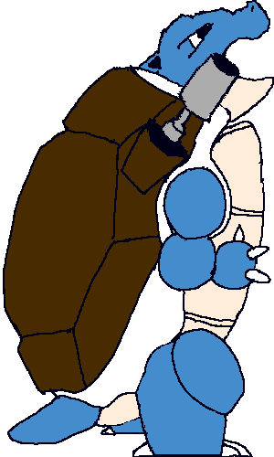
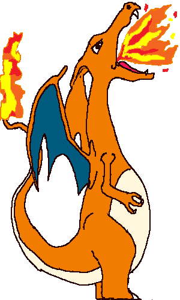

#PokeFighters

##Game Dev Approach:
* All stats are hard coded into objects - so far only two objects (pokemon) exist. More will be added if time permits and then these objects will be placed in an array for organized storage
* All functionality of the game is calculated and managed using the stats of the objects and necessary animations will translate into the DOM.
* All DOM manipulation is done with JQuery.

##User Stories:
* As a player, I want to be able to choose the starter pokemon I want to play as
* As a player, I want to be able to move my pokemon
* As a player, I want to be able to attack the opponent
* As a player, I want to be able to defend from an opponent's attack
* As a player, I want to see my pokemon's health and combo counter
* As a player, I want to be able to keep track of how much time is left in the round
* As a player, I want to see how many rounds I have already won in the best of 3/5
* As a player, I want to see my pokemon move fluidly

##Game Mechanics:

###Default stats:
* HP=100
* BaseDamage=5
* AttackSpeed=10
* BlockStrength=10

##Fast Attack:
###P1 :  1
###P2 :  ,
* Players must be colliding to attack. Damage does not increase with evolution. However, this attack is a good method to build your combo while keeping the opponent stunned.

## Strong Attack:
###P1 :  2
###P2 :  .
* Damage increases with each evolution. However, the attack animation lock lasts longer than the stun given so the opponent will most likely be able to reset your combo.

####Combo:

* Combo resets after 3 seconds or when hit when not blocking. The countdown will refresh with each hit given.
* Reaching a 3rd consecutive hit will cause the first evolution -- strong attack damage doubles
* Reaching a 6th consecutive hit will cause the second evolution -- strong attack damage triples
* Evolution reverts after 5 seconds.

##Block:
###P1 :  3
###P2 :  /

* When blocking, a player will receive reduced damage (based on blockstrength) and will not suffer from the stun effect.
* However, each player can only block up to 3 times before waiting for the blocks to recharge. Blocks will restore after 3 seconds but blocking will reset this timer.

####Stun:

* When hit, a player will be stunned (cannot retaliate in that time.) However, the player can still block.