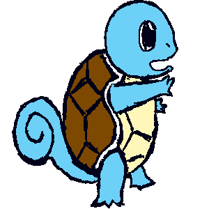

#PokeFighters

##Game Dev Approach:
* All stats are hard coded into objects - so far only two objects (pokemon) exist. More will be added if time permits and then these objects will be placed in an array for organized storage
* All functionality of the game is calculated and managed using the stats of the objects and necessary animations will translate into the DOM.
* So far, the javascript is a mix of native javascript and JQuery but I plan on converting to fully utilize JQuery to ensure browser compatibility.

##User Stories:
* As a player, I want to be able to choose the starter pokemon I want to play as
* As a player, I want to be able to move my pokemon
* As a player, I want to be able to attack the opponent
* As a player, I want to be able to defend from an opponent's attack
* As a player, I want to see my pokemon's health and combo counter
* As a player, I want to be able to keep track of how much time is left in the round
* As a player, I want to see how many rounds I have already won in the best of 3/5
* As a player, I want to see my pokemon move fluidly

##Game Mechanics:

###Default stats:
* HP=100
* BaseDamage=10
* AttackSpeed=10
* BlockStrength=10

##Attack:
###P1 : (1)
###P2 : (.)
* Players must be colliding to attack. The player DPS is based on basedamage and attackspeed.

####Combo:

* Combo resets after 3 seconds. This countdown will refresh with each hit.
* Reaching a 3rd consecutive hit will cause the first evolution -- attack speed doubles
* TODO: Reaching a 6th consecutive hit will cause the second evolution -- damage doubles
* Evolution reverts after 5 seconds.

##Block:
###P1 : (2)
###P2 : (/)

* When blocking, a player will receive reduced damage (based on blockstrength) and will not suffer from the stun effect.

* However, blocking has a cooldown of 3 seconds. Use your blocks wisely.

####Stun:

* When hit, a player will be stunned for .25 seconds (cannot retaliate in that time.) However, the player can still block.

##Planned Features (some may not be implemented in final product):

###Dan's Ideas:

- [ ] combo 6 - evolve to final form (wartortle -> blastoise)

###Combat:

- [ ] Separate attacks into high, normal and low -- probably implement crouching ability as well (attack while crouching to attack low and dodge high attacks at the same time)

    * high attacks -- vulnerable spot so more damage

    * low attacks -- faster, but less damage

###Movement:

- [ ] Jumping(???)

- [ ] dashing forward and backward to quickly engage/disengage